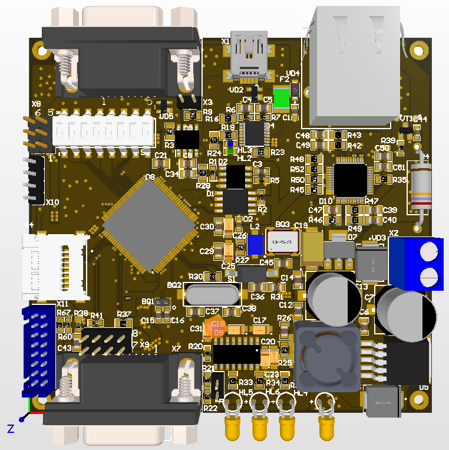
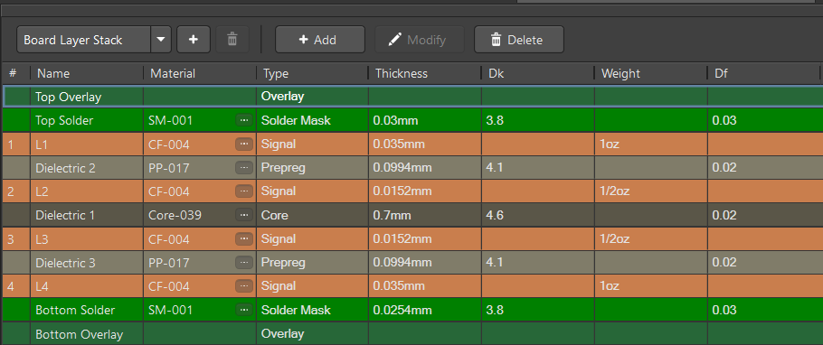
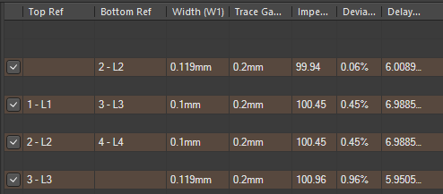
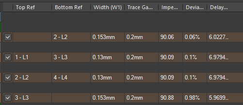
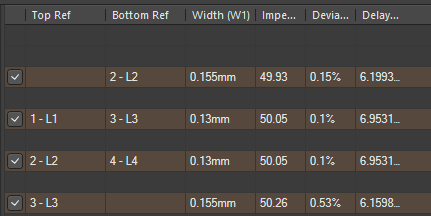

# CNCU-01 4-Layer PCB Redesign

## Overview

* This project is a PCB redesign of the open-source CNCU-01 controller board.

* The original design was implemented as a 2-layer PCB. In this project, the board was migrated to a 4-layer stackup to improve routing quality, power integrity, and manufacturability.

## Layer Stackup

## Differential Pair Calculation (SI9000)
Differential impedance: 100Ω

Differential impedance: 90Ω

Single-ended impedance: 50Ω

## My Contributions

* Migrated the original PCB from 2 layers to 4 layers
* Defined a new PCB stackup
* Calculated controlled impedance traces using SI9000
* Configured differential pair routing rules
* Optimized power and ground planes

## Tools

- Altium Designer
- SI9000

## Reference

Original project:
https://github.com/MikhailBerezhanov/CNCU-01
