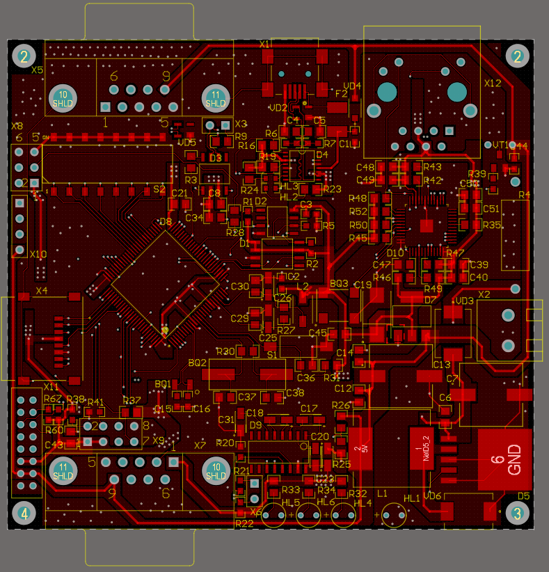
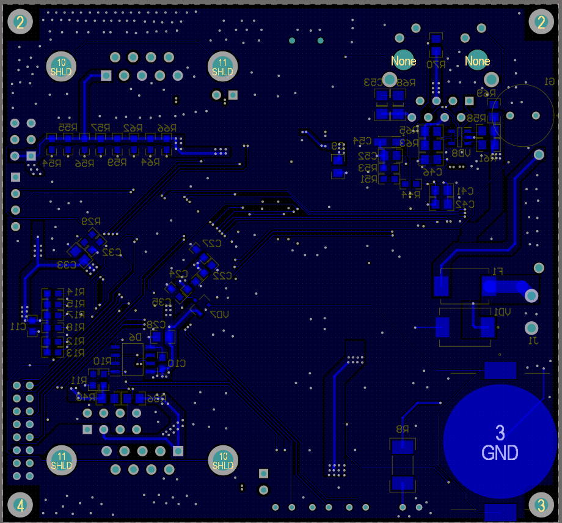

# CNCU-01 4-Layer PCB Redesign

## Overview

* This project is a PCB redesign of the open-source CNCU-01 controller board.

* The original CNCU-01 controller board was designed as a 2-layer PCB. In this project, the board was redesigned into a 4-layer stackup to improve routing flexibility, power distribution, and signal routing quality.

## Design Flow

- Hardware Architecture Study
- Schematic Analysis
- PCB Stackup Definition
- Impedance Calculation (SI9000)
- Differential Pair Rule Configuration
- Component Placement
- PCB Routing
- Manufacturing Output Generation

## Layer Stackup

## Differential Pair Calculation (SI9000)
* Differential impedance: 100Ω

* Differential impedance: 90Ω

* Single-ended impedance: 50Ω

## My Contributions

* Migrated the original PCB from 2 layers to 4 layers
* Defined a new PCB stackup
* Calculated controlled impedance traces using SI9000
* Configured differential pair routing rules
* Optimized power and ground planes

## Manufacturing Outputs

Generated outputs:

- BOM
- Gerber Files
- NC Drill Files

## Tools

- Altium Designer
- SI9000
